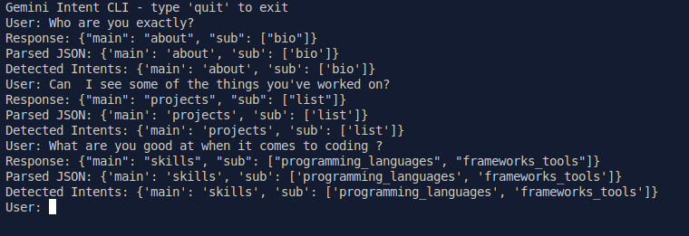

# 🧠 Mini Project 1: Gemini-Powered Intent Detection CLI

A command-line interface (CLI) tool built with Python and Gemini Flash that detects user intent based on natural language queries. This project is the first building block for my AI-powered personal portfolio chatbot.

---

## 🚀 Features

- 🔍 Detects both `main` and `sub` intents from any user query
- 🤖 Powered by Google Gemini 1.5 Flash via `google-generativeai`
- 💬 Few-shot prompt engineering to guide intent classification
- 🛡️ Built-in error handling for invalid or malformed responses
- 🔁 Interactive CLI loop for multi-turn testing
- 🧪 Handles both direct and indirect language inputs

---

## 📦 Technologies Used

- Python 3.11
- Google Generative AI (`gemini-1.5-flash`)
- dotenv for secure API key management
- JSON parsing and safe error handling

---

## 🛠️ How to Run

1. **Clone the Repo:**

```bash
git clone https://github.com/manjil-budhathoki/Gemini-Intent-Detector
cd Gemini-Intent-Detector
````

2. **Install Dependencies:**

```bash
pip install -r requirements.txt
```

3. **Add Your API Key:**

Create a `.env` file with:

```
GEMINI_API_KEY=your_google_api_key_here
```

4. **Run the CLI Tool:**

```bash
python Intent_detector.py
```

---

## 🧠 Example Queries



---

## ✅ Learning Outcomes

* Understood how to load and call Gemini Flash
* Learned prompt engineering with examples and format control
* Practiced JSON parsing and safe error handling
* Built a reusable intent detection module for future projects

---

## ⚠️ Known Issues

* Gemini sometimes returns code-block-wrapped JSON (` ```json ... ``` `)
* Handled using `strip()` and prompt tweaks (`"Never wrap in backticks"`)

---

## 🧩 What's Next

In the next mini project, I will:

* Generate actual responses based on detected intents
* Add rule-based and LLM-based reply generation
* Start building a smart portfolio chatbot that feels conversational and helpful

---

## 🧑‍💻 Author

**Manjil Budhathoki**
AI Student | Developer | Project Builder
[LinkedIn](https://www.linkedin.com/in/manjil-budhathoki/) • [GitHub](https://github.com/manjil-budhathoki)

---
